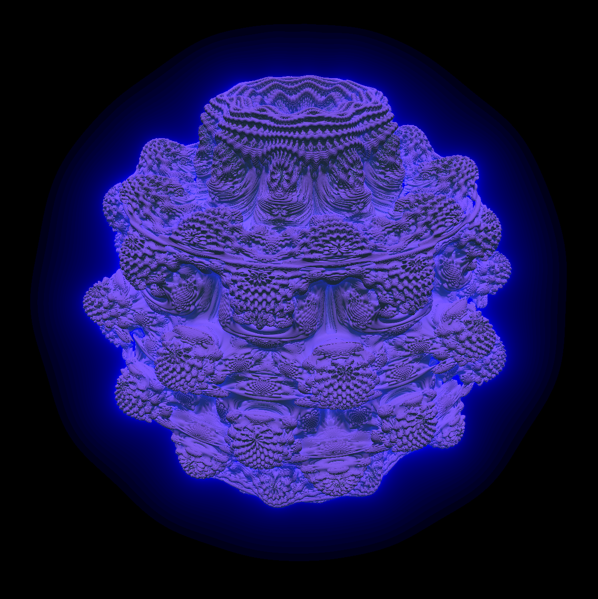
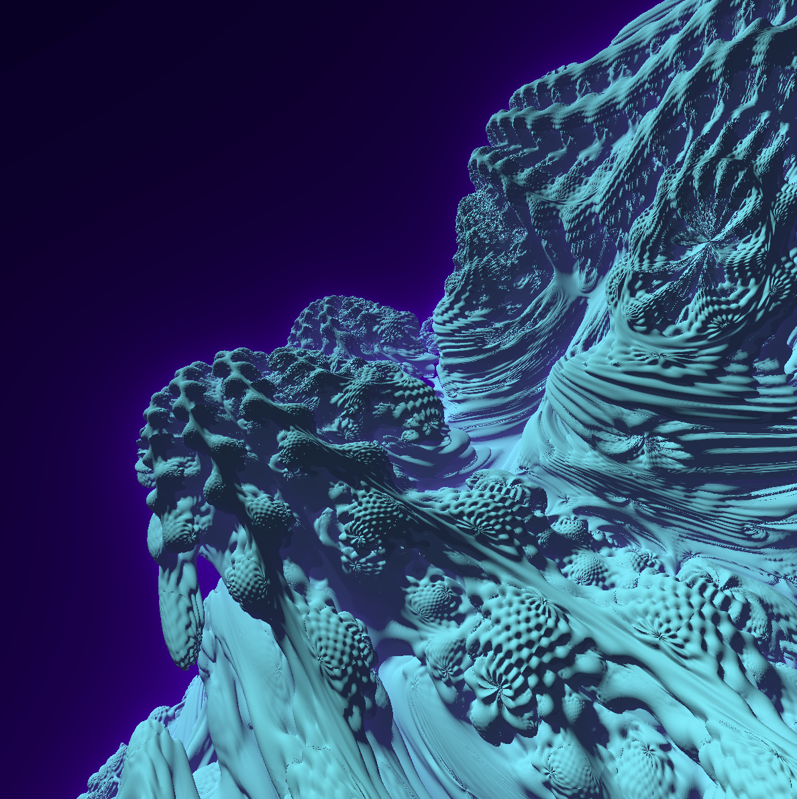
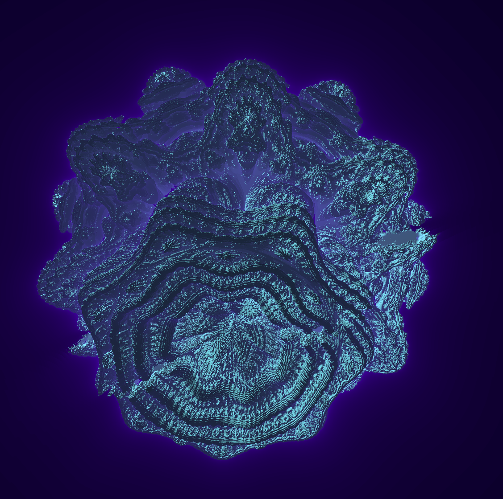

# Raymarching the mandlebulb

Simple program to play around with raymarching. Trying to create a pleasing looking mandlebulb renders.

This is a rust + bevy program. Run with `cargo run` (or `cargo run --release`).

#### Controls:

- `WASD + RF` to move camera.
- Arrow keys to look around (bit buggy atm)
- `PgUp`/`PgDown` to zoom in/out.
- `Home` / `End` to scroll through the fractal power.
